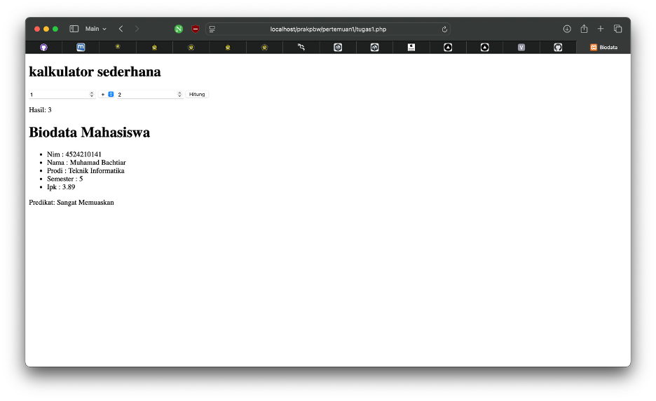
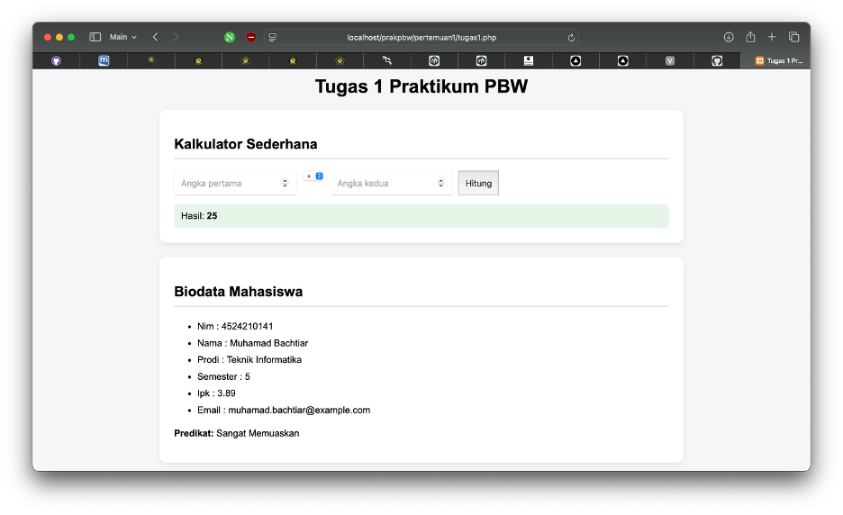
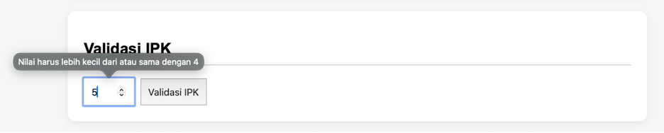

# Praktikum Pemrograman Berbasis Web

Repository ini digunakan untuk menyimpan tugas dan praktikum mata kuliah **Pemrograman Berbasis Web**.

## Profil

- **Nama:** Muhamad Bachtiar
- **NPM:** 4524210141
- **Program Studi:** Teknik Informatika
- **Mata Kuliah:** Pemrograman Berbasis Web - B

---

# Pertemuan 1

## Tugas 1

Pada Pertemuan 1, tugas yang dikerjakan meliputi:

1. Menjalankan seluruh contoh program.
2. Membuat minimal dua modifikasi bermakna.
3. Menjelaskan lima bagian kode yang penting.
4. Menampilkan screenshot sebelum dan sesudah modifikasi.

## File Program

[tugas1.php](tugas1.php)

---

## Screenshot Sebelum Modifikasi

Screenshot berikut menunjukkan program sebelum dilakukan modifikasi.



---

## Screenshot Sesudah Modifikasi

Screenshot berikut menunjukkan program setelah dilakukan modifikasi.



---

## Modifikasi Program

### 1. Validasi Input IPK

Modifikasi pertama adalah menambahkan validasi nilai IPK.

Nilai IPK harus berada pada rentang **0.00 sampai 4.00**.

Jika pengguna memasukkan nilai di luar rentang tersebut, sistem akan menampilkan pesan kesalahan.

### 2. Styling Halaman

Modifikasi kedua adalah menambahkan CSS untuk membuat tampilan program lebih terstruktur dan mudah dibaca.

Tampilan dibagi menjadi beberapa card untuk memisahkan bagian kalkulator, biodata, dan validasi IPK.

---

## Screenshot Validasi IPK



---

# Lima Bagian Kode Penting

## 1. Request Method

```php
if ($_SERVER['REQUEST_METHOD'] === 'POST') {
```

Kode tersebut digunakan untuk memastikan proses kalkulator dilakukan ketika form dikirim menggunakan metode `POST`.

---

## 2. Pengambilan Input

```php
$a = (float) ($_POST['a'] ?? 0);
$b = (float) ($_POST['b'] ?? 0);
```

Kode tersebut digunakan untuk mengambil nilai input dari form dan mengubahnya menjadi tipe data `float`.

---

## 3. Switch Operator

```php
switch ($operator) {
```

Kode tersebut digunakan untuk menentukan operasi matematika berdasarkan operator yang dipilih pengguna.

---

## 4. Function Status Kelulusan

```php
function statusKelulusan(float $ipk): string
```

Function tersebut digunakan untuk menentukan predikat mahasiswa berdasarkan nilai IPK.

---

## 5. Validasi IPK

```php
if ($ipkInput < 0 || $ipkInput > 4) {
```

Kode tersebut digunakan untuk memastikan nilai IPK yang dimasukkan berada dalam rentang yang valid, yaitu 0.00 sampai 4.00.

---