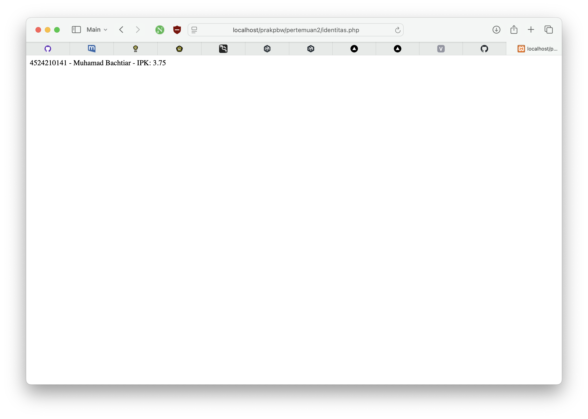
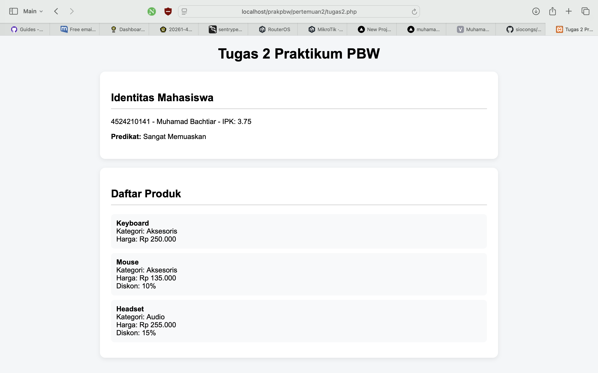

# Tugas 2 - Praktikum Pemrograman Berbasis Web

## Identitas

- **Nama:** Muhamad Bachtiar
- **NIM:** 4524210141
- **Program Studi:** Teknik Informatika
- **Mata Kuliah:** Pemrograman Berbasis Web

---

# Pertemuan 2

## Tujuan

Pada Pertemuan 2, praktikum membahas konsep Object-Oriented Programming (OOP) menggunakan PHP.

Konsep yang digunakan meliputi:

- Interface
- Class
- Object
- Constructor
- Encapsulation
- Inheritance
- Polymorphism
- Validasi

---

# Tugas 2

Tugas yang dikerjakan meliputi:

1. Menjalankan seluruh contoh Pertemuan 2 hingga menghasilkan output tanpa error kritis.
2. Membuat minimal dua modifikasi bermakna.
3. Menjelaskan lima bagian kode yang dianggap penting.
4. Menyertakan screenshot sebelum dan sesudah modifikasi.
5. Menjelaskan satu error yang pernah muncul, penyebab, dan langkah perbaikannya.

## File Program

[tugas2.php](tugas2.php)

---

# Screenshot

## Sebelum Modifikasi

Screenshot berikut menunjukkan hasil program sebelum dilakukan modifikasi.



---

## Sesudah Modifikasi

Screenshot berikut menunjukkan hasil program setelah dilakukan modifikasi.



---

# Modifikasi Program

## 1. Menambahkan Predikat IPK

Modifikasi pertama adalah menambahkan method `predikat()` pada class `Mahasiswa`.

Method tersebut menentukan predikat mahasiswa berdasarkan nilai IPK.

Ketentuan yang digunakan:

- IPK >= 3.50: Sangat Memuaskan
- IPK >= 3.00: Memuaskan
- IPK < 3.00: Perlu Peningkatan

---

## 2. Menambahkan Kategori dan Validasi Diskon

Modifikasi kedua adalah menambahkan atribut kategori pada class `Produk`.

Selain itu, ditambahkan validasi diskon pada class `ProdukDiskon`.

Nilai diskon harus berada pada rentang 0 sampai 100 persen.

---

# Lima Bagian Kode Penting

## 1. Interface

```php
interface Identitas
{
    public function ringkasan(): string;
}
```

Interface digunakan untuk menentukan method yang harus dimiliki oleh class yang mengimplementasikannya.

---

## 2. Constructor

```php
public function __construct(
    string $nim,
    string $nama,
    float $ipk
)
```

Constructor digunakan untuk menginisialisasi data ketika object `Mahasiswa` dibuat.

---

## 3. Validasi IPK

```php
if ($ipk < 0 || $ipk > 4) {
    throw new InvalidArgumentException(
        'IPK harus berada di antara 0 sampai 4.'
    );
}
```

Kode tersebut memastikan nilai IPK berada pada rentang yang valid.

---

## 4. Inheritance

```php
class ProdukDiskon extends Produk
```

Inheritance digunakan agar class `ProdukDiskon` dapat mewarisi atribut dan method dari class `Produk`.

---

## 5. Polymorphism

```php
foreach ($daftar as $produk) {
    $produk->hargaAkhir();
}
```

Polymorphism memungkinkan method `hargaAkhir()` menghasilkan perilaku yang berbeda berdasarkan object yang digunakan.

---

# Error dan Perbaikan

## Error
Screenshot berikut menunjukkan hasil program setelah dilakukan modifikasi.


Pada contoh program terdapat ketidaksesuaian tipe return pada interface `BisaDihitung`.

Interface mendefinisikan:

```php
public function hargaAkhir(): string;
```

sedangkan class mengimplementasikannya sebagai:

```php
public function hargaAkhir(): float;
```

## Penyebab

Return type pada interface dan method yang mengimplementasikannya harus konsisten.

## Perbaikan

Return type pada interface diubah menjadi:

```php
public function hargaAkhir(): float;
```

Selain itu, pemanggilan method `getNama` juga harus menggunakan tanda kurung:

```php
$produk->getNama()
```

---

# Kesimpulan

Pada Pertemuan 2, saya mempelajari konsep dasar Object-Oriented Programming menggunakan PHP.

Konsep yang dipraktikkan meliputi interface, class, object, constructor, encapsulation, inheritance, polymorphism, dan validasi.

Modifikasi dilakukan dengan menambahkan predikat IPK serta kategori dan validasi diskon pada produk.