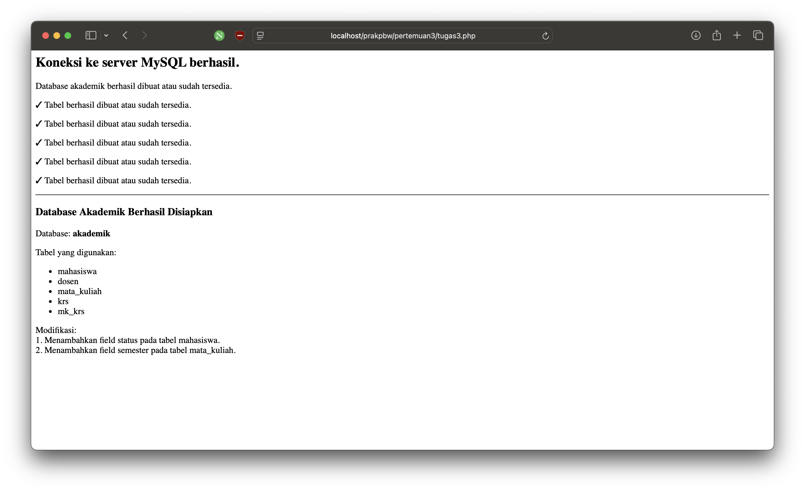

# Tugas 3 - MySQL Dasar

## Identitas

- **Nama:** Muhamad Bachtiar
- **NIM:** 4524210141
- **Program Studi:** Teknik Informatika
- **Mata Kuliah:** Pemrograman Berbasis Web
- **Pertemuan:** 3
- **Materi:** MySQL Dasar

---

## Deskripsi

Pada Pertemuan 3 dipelajari dasar penggunaan MySQL dengan PHP.

Praktikum menggunakan studi kasus database akademik. Program dibuat
menggunakan PHP dan ekstensi `mysqli` untuk menghubungkan PHP dengan
server MySQL.

Materi yang dipraktikkan meliputi:

1. Membuat koneksi PHP dengan MySQL.
2. Membuat database `akademik`.
3. Membuat tabel menggunakan query SQL.
4. Menggunakan primary key.
5. Menggunakan foreign key.
6. Membuat relasi antar tabel.
7. Menjalankan query menggunakan `mysqli_query()`.

---

## File Program

Program utama pada tugas ini terdapat pada:

[`tugas3.php`](tugas3.php)

---

## Database Akademik

Database yang digunakan dalam praktikum adalah:

```text
akademik
```

Database terdiri dari beberapa tabel:

- `mahasiswa`
- `dosen`
- `mata_kuliah`
- `krs`
- `mk_krs`

Relasi antar tabel digunakan untuk menggambarkan hubungan antara
mahasiswa, dosen, mata kuliah, dan KRS.

---

## Cara Menjalankan Program

### 1. Jalankan XAMPP

Aktifkan service:

- Apache
- MySQL

### 2. Pastikan Repository Berada di `htdocs`

Contoh lokasi repository:

```text
/Applications/XAMPP/xamppfiles/htdocs/PrakPBW
```

### 3. Jalankan Program

Buka browser dan akses:

```text
http://localhost/PrakPBW/pertemuan3/tugas3.php
```

Program akan melakukan koneksi ke MySQL kemudian membuat database
`akademik` beserta tabel yang diperlukan.

---

## Modifikasi Program

### 1. Menambahkan Status Mahasiswa

Modifikasi pertama adalah menambahkan field `status` pada tabel
`mahasiswa`.

Kode yang ditambahkan:

```sql
status VARCHAR(20) NOT NULL DEFAULT 'Aktif'
```

Field ini digunakan untuk menyimpan status mahasiswa, misalnya:

- Aktif
- Cuti
- Lulus
- Tidak Aktif

Modifikasi ini membuat informasi mahasiswa menjadi lebih lengkap.

---

### 2. Menambahkan Semester Mata Kuliah

Modifikasi kedua adalah menambahkan field `semester` pada tabel
`mata_kuliah`.

Kode yang ditambahkan:

```sql
semester TINYINT UNSIGNED NOT NULL DEFAULT 1
```

Field ini digunakan untuk menunjukkan semester ketika suatu mata
kuliah biasanya diberikan.

Contohnya:

- Pemrograman Web → Semester 3
- Basis Data → Semester 4
- Sistem Pendukung Keputusan → Semester 5

---

## Screenshot Sebelum Modifikasi

Screenshot berikut menunjukkan kondisi program sebelum dilakukan
modifikasi.


---

## Screenshot Sesudah Modifikasi

Screenshot berikut menunjukkan kondisi program setelah dilakukan
modifikasi.



---

## Lima Bagian Kode yang Penting

### 1. Koneksi ke MySQL

```php
$koneksi = mysqli_connect($host, $user, $password);
```

Bagian ini digunakan untuk menghubungkan program PHP dengan server
MySQL.

Tanpa koneksi tersebut, PHP tidak dapat menjalankan query ke database.

---

### 2. Pembuatan Database

```php
$sqlCreateDB = "CREATE DATABASE IF NOT EXISTS akademik";
```

Query tersebut digunakan untuk membuat database `akademik`.

Penggunaan `IF NOT EXISTS` membuat query tidak gagal apabila database
sudah tersedia.

---

### 3. Pemilihan Database

```php
mysqli_select_db($koneksi, "akademik");
```

Bagian ini digunakan untuk memilih database `akademik` sebagai database
yang digunakan oleh koneksi.

---

### 4. Pembuatan Tabel

```sql
CREATE TABLE IF NOT EXISTS mahasiswa (
    id BIGINT UNSIGNED AUTO_INCREMENT PRIMARY KEY,
    nim VARCHAR(15) NOT NULL UNIQUE,
    nama VARCHAR(100) NOT NULL,
    ...
)
```

Bagian ini digunakan untuk membuat struktur tabel.

Pada tabel tersebut terdapat primary key dan beberapa atribut yang
digunakan untuk menyimpan data mahasiswa.

---

### 5. Foreign Key

```sql
FOREIGN KEY (dosen_id)
REFERENCES dosen(id)
ON UPDATE CASCADE
ON DELETE SET NULL
```

Foreign key digunakan untuk menghubungkan tabel `mata_kuliah` dengan
tabel `dosen`.

Dengan demikian, data dosen yang digunakan pada suatu mata kuliah
memiliki hubungan dengan data pada tabel `dosen`.

---

## Error yang Pernah Muncul

### Error: Koneksi MySQL Gagal

Salah satu error yang dapat terjadi adalah ketika PHP tidak dapat
terhubung dengan server MySQL.

Contoh pesan error:

```text
Koneksi gagal: Connection refused
```

### Penyebab

MySQL pada XAMPP belum dijalankan atau konfigurasi koneksi tidak sesuai.

### Perbaikan

Langkah perbaikannya adalah:

1. Membuka XAMPP.
2. Menjalankan service MySQL.
3. Memastikan host menggunakan `127.0.0.1`.
4. Memastikan username menggunakan `root`.
5. Memastikan password sesuai dengan konfigurasi MySQL.
6. Menjalankan kembali program melalui browser.

---

## Kesimpulan

Pada tugas ini telah dipraktikkan penggunaan PHP untuk terhubung
dengan MySQL menggunakan `mysqli`.

Program digunakan untuk membuat database `akademik` dan beberapa tabel
yang saling berhubungan.

Selain mengikuti contoh pada materi, dilakukan dua modifikasi berupa
penambahan field `status` pada tabel `mahasiswa` dan field `semester`
pada tabel `mata_kuliah`.