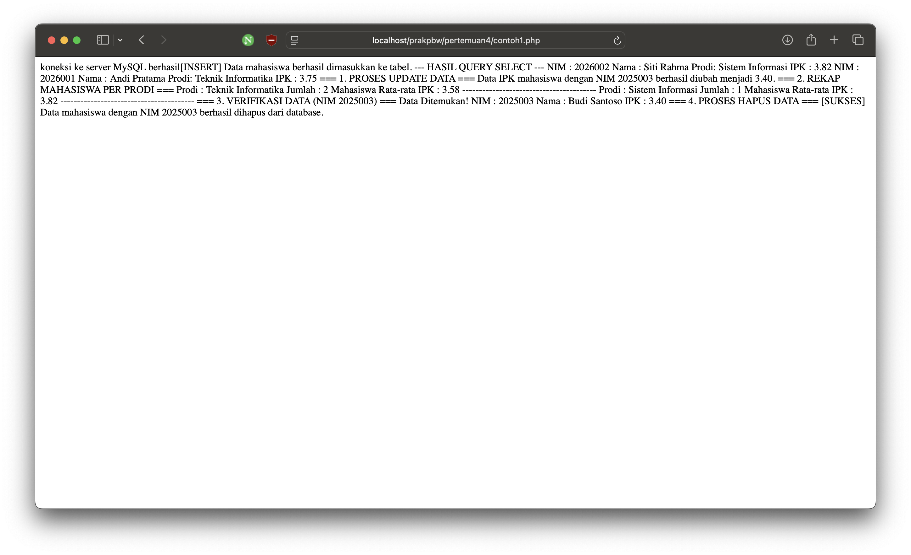
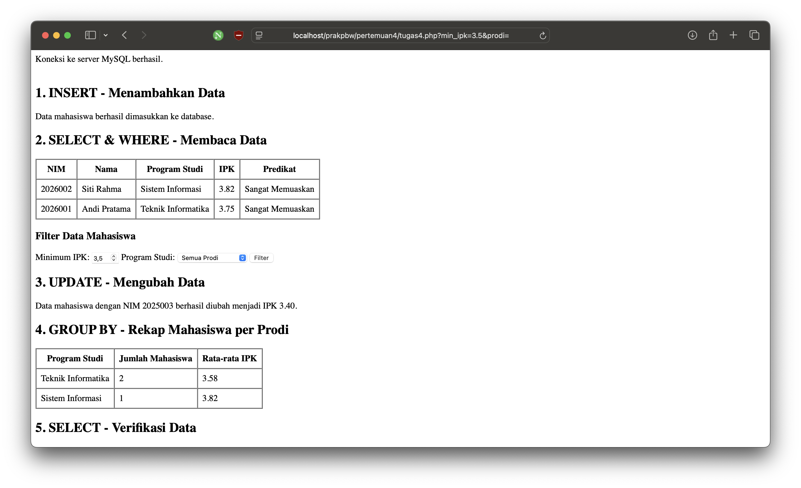
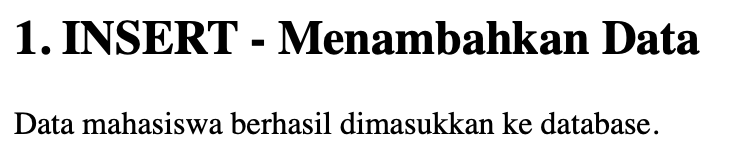
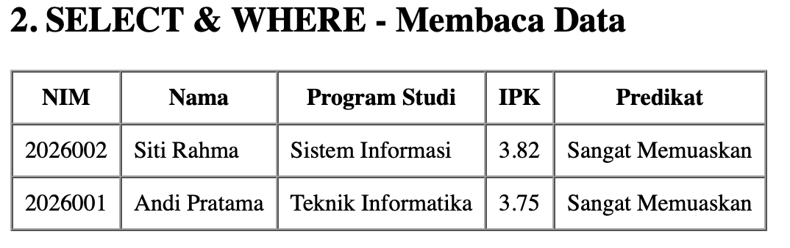
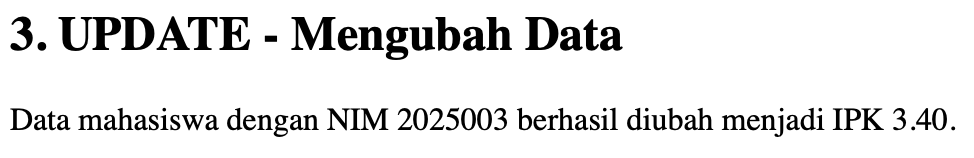
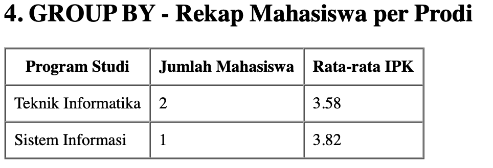
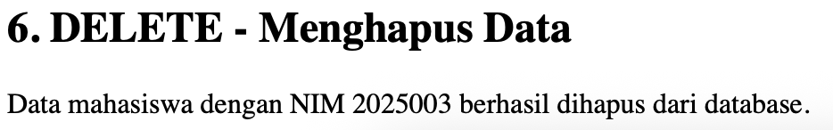

# Tugas 4 - Query Dasar

## Identitas

- **Nama:** Muhamad Bachtiar
- **NIM:** 4524210141
- **Program Studi:** Teknik Informatika
- **Mata Kuliah:** Pemrograman Berbasis Web
- **Pertemuan:** 4
- **Materi:** Query Dasar

---

## Deskripsi

Pada Pertemuan 4 dipelajari penggunaan query dasar SQL dengan PHP
dan MySQL.

Studi kasus yang digunakan adalah database akademik dengan tabel
`mahasiswa`.

Query yang dipraktikkan meliputi:

1. `INSERT`
2. `SELECT`
3. `WHERE`
4. `UPDATE`
5. `GROUP BY`
6. `DELETE`

Program dijalankan menggunakan PHP dan ekstensi `mysqli`.

---

## File Program

Program utama pada tugas ini terdapat pada:

[`tugas4.php`](tugas4.php)

---

## Database

Database yang digunakan:

```text
akademik
```

Tabel yang digunakan:

```text
mahasiswa
```

Kolom utama yang digunakan:

```text
nim
nama
email
prodi
angkatan
ipk
```

---

## Cara Menjalankan Program

### 1. Jalankan XAMPP

Aktifkan:

```text
Apache
MySQL
```

### 2. Pastikan database tersedia

Database:

```text
akademik
```

dan tabel:

```text
mahasiswa
```

harus sudah tersedia dari praktikum sebelumnya.

### 3. Jalankan melalui browser

Akses:

```text
http://localhost/PrakPBW/pertemuan4/tugas4.php
```

Program kemudian menjalankan beberapa query dasar terhadap
database akademik.

---

# Query yang Dipraktikkan

## 1. INSERT

`INSERT` digunakan untuk menambahkan data mahasiswa ke dalam tabel.

Contoh:

```sql
INSERT INTO mahasiswa
(nim, nama, email, prodi, angkatan, ipk)
VALUES
('2026001', 'Andi Pratama', 'andi@kampus.ac.id',
 'Teknik Informatika', 2026, 3.75);
```

Pada program digunakan `INSERT IGNORE` agar data dengan NIM yang
sudah tersedia tidak menyebabkan proses gagal ketika program
dijalankan kembali.

---

## 2. SELECT dan WHERE

`SELECT` digunakan untuk mengambil data dari tabel mahasiswa,
sedangkan `WHERE` digunakan untuk menyaring data berdasarkan
kondisi tertentu.

Contoh:

```sql
SELECT nim, nama, prodi, ipk
FROM mahasiswa
WHERE ipk >= 3.50
ORDER BY ipk DESC, nama ASC
LIMIT 10;
```

---

## 3. UPDATE

`UPDATE` digunakan untuk mengubah data yang sudah terdapat di
dalam database.

Pada program, data mahasiswa dengan NIM `2025003` diubah nilai
IPK-nya menjadi `3.40`.

```sql
UPDATE mahasiswa
SET ipk = 3.40
WHERE nim = '2025003';
```

---

## 4. GROUP BY

`GROUP BY` digunakan untuk mengelompokkan data berdasarkan
program studi.

Program juga menghitung jumlah mahasiswa dan rata-rata IPK
setiap program studi.

```sql
SELECT
    prodi,
    COUNT(*) AS jumlah,
    ROUND(AVG(ipk), 2) AS rata_ipk
FROM mahasiswa
GROUP BY prodi
ORDER BY jumlah DESC;
```

---

## 5. DELETE

`DELETE` digunakan untuk menghapus data dari database.

Sebelum data dihapus, program melakukan verifikasi menggunakan
`SELECT`.

Contoh:

```sql
DELETE FROM mahasiswa
WHERE nim = '2025003';
```

---

# Modifikasi Program

## 1. Filter Minimum IPK dan Program Studi

Modifikasi pertama adalah menambahkan filter yang dapat digunakan
untuk menyaring mahasiswa berdasarkan nilai minimum IPK dan
program studi.

Pengguna dapat menentukan nilai minimum IPK melalui form.

Contoh:

```text
Minimum IPK: 3.50
Program Studi: Teknik Informatika
```

Program kemudian menampilkan data mahasiswa yang sesuai dengan
kriteria tersebut.

Modifikasi ini membuat query `SELECT` menjadi lebih fleksibel
karena pengguna dapat menentukan kriteria pencarian.

---

## 2. Menambahkan Predikat Mahasiswa

Modifikasi kedua adalah menambahkan predikat berdasarkan nilai IPK.

Ketentuannya:

```text
IPK >= 3.50
Sangat Memuaskan

IPK >= 3.00
Memuaskan

IPK < 3.00
Perlu Peningkatan
```

Contoh kode:

```php
if ($row['ipk'] >= 3.50) {
    $predikat = "Sangat Memuaskan";
} elseif ($row['ipk'] >= 3.00) {
    $predikat = "Memuaskan";
} else {
    $predikat = "Perlu Peningkatan";
}
```

Modifikasi ini memberikan informasi tambahan pada hasil query
berdasarkan kondisi nilai IPK.

---

# Screenshot Sebelum Modifikasi

Screenshot berikut menunjukkan program sebelum dilakukan
modifikasi.



---

# Screenshot Sesudah Modifikasi

Screenshot berikut menunjukkan program setelah dilakukan
modifikasi.



---

# Screenshot Hasil Query

## INSERT



## SELECT dan WHERE



## UPDATE



## GROUP BY



## DELETE



---

# Lima Bagian Kode yang Penting

## 1. Koneksi ke Database

```php
$koneksi = mysqli_connect(
    $host,
    $user,
    $password,
    $database
);
```

Bagian ini digunakan untuk menghubungkan program PHP dengan
database MySQL.

Tanpa koneksi tersebut, program tidak dapat menjalankan query
terhadap database.

---

## 2. Query INSERT

```php
$sqlInsert = "
    INSERT IGNORE INTO mahasiswa
    (nim, nama, email, prodi, angkatan, ipk)
    VALUES (...)
";
```

Bagian ini digunakan untuk menambahkan data mahasiswa ke dalam
tabel `mahasiswa`.

---

## 3. Query SELECT dan WHERE

```php
SELECT nim, nama, prodi, ipk
FROM mahasiswa
WHERE ipk >= ?
```

Bagian ini digunakan untuk mengambil data mahasiswa berdasarkan
kriteria tertentu.

Pada program, nilai minimum IPK dapat ditentukan melalui form.

---

## 4. Query UPDATE

```php
UPDATE mahasiswa
SET ipk = 3.40
WHERE nim = '2025003'
```

Bagian ini digunakan untuk mengubah nilai IPK mahasiswa tertentu
berdasarkan NIM.

---

## 5. Query GROUP BY

```php
SELECT
    prodi,
    COUNT(*) AS jumlah,
    ROUND(AVG(ipk), 2) AS rata_ipk
FROM mahasiswa
GROUP BY prodi
```

Bagian ini digunakan untuk mengelompokkan mahasiswa berdasarkan
program studi dan menghitung jumlah mahasiswa serta rata-rata IPK
setiap program studi.

---

# Error yang Pernah Muncul

## Error: Koneksi MySQL Gagal

Salah satu error yang dapat terjadi adalah PHP tidak dapat
terhubung dengan server MySQL.

Contoh pesan error:

```text
Koneksi gagal: Connection refused
```

### Penyebab

MySQL pada XAMPP belum dijalankan atau konfigurasi koneksi
database tidak sesuai.

### Langkah Perbaikan

1. Membuka XAMPP.
2. Menjalankan service MySQL.
3. Memastikan host menggunakan `127.0.0.1`.
4. Memastikan username menggunakan `root`.
5. Memastikan password sesuai dengan konfigurasi MySQL.
6. Memastikan database `akademik` tersedia.
7. Menjalankan kembali program melalui browser.

---

# Kesimpulan

Pada tugas ini telah dipraktikkan query dasar MySQL menggunakan
PHP dan `mysqli`.

Query yang digunakan meliputi:

```text
INSERT
SELECT
WHERE
UPDATE
GROUP BY
DELETE
```

Selain menjalankan contoh dari materi, program juga dimodifikasi
dengan menambahkan filter data mahasiswa dan predikat berdasarkan
IPK.