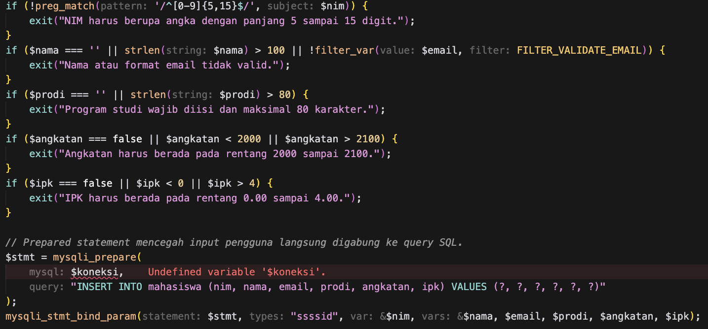
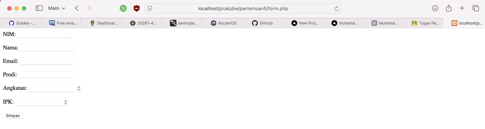
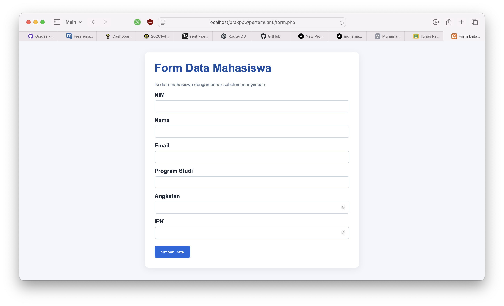
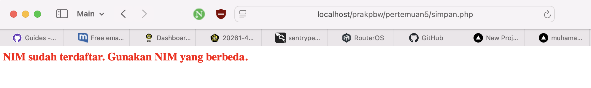

# Tugas Pertemuan 5 — Integrasi PHP

## Identitas
- **Nama:** Muhamad Bachtiar
- **NIM:** 4524210141
- **Program Studi:** Teknik Informatika
- **Mata Kuliah:** Pemrograman Berbasis Web
- **Pertemuan:** 5 — Integrasi PHP

## Deskripsi
Program ini mengintegrasikan form HTML, PHP, dan MySQL untuk menyimpan data mahasiswa ke tabel `mahasiswa` pada database `akademik`. File `koneksi.php` digunakan untuk koneksi database, `form.php` untuk input, `simpan.php` untuk validasi dan penyimpanan, sedangkan `data.php` untuk menampilkan data.

## Modifikasi yang Dilakukan
1. **Perbaikan `form.php`:** menambahkan validasi input di sisi browser, seperti panjang dan pola NIM, batas angkatan, serta IPK 0–4. Tampilan form juga dirapikan agar lebih mudah digunakan.
2. **Perbaikan `simpan.php`:** menambahkan validasi server-side, penggunaan prepared statement, dan pesan khusus jika NIM sudah terdaftar. Output nama dan NIM di-escape menggunakan `htmlspecialchars()`.

## Lima Bagian Kode Penting
1. **Koneksi database — `koneksi.php`:** `mysqli_connect()` menghubungkan PHP ke database `akademik`.
2. **Form POST — `form.php`:** atribut `method="post"` mengirim data form ke `simpan.php` tanpa menaruh data di URL.
3. **Pengambilan input — `trim()` dan `$_POST`:** mengambil nilai yang dikirim pengguna dan menghapus spasi di awal/akhir.
4. **Validasi server-side:** `filter_var()` dan `preg_match()` memeriksa format serta rentang NIM, email, angkatan, dan IPK.
5. **Prepared statement:** `mysqli_prepare()` dan `mysqli_stmt_bind_param()` mengirim data ke query dengan parameter terpisah sehingga input tidak langsung digabungkan ke SQL.

## Screenshot Sebelum dan Sesudah
- **Sebelum modifikasi:** 

- **Sesudah modifikasi:** 

Screenshot perlu diambil dari hasil program yang benar-benar dijalankan di komputer.

## Contoh Error, Penyebab, dan Perbaikan
**Error:** `NIM sudah terdaftar. Gunakan NIM yang berbeda.`

**Penyebab:** NIM yang dimasukkan sudah ada pada tabel mahasiswa dan kolom NIM tidak boleh duplikat.

**Perbaikan:** gunakan NIM yang belum terdaftar, lalu kirim ulang form. Program juga menangani kondisi ini dengan menampilkan pesan yang lebih jelas.
